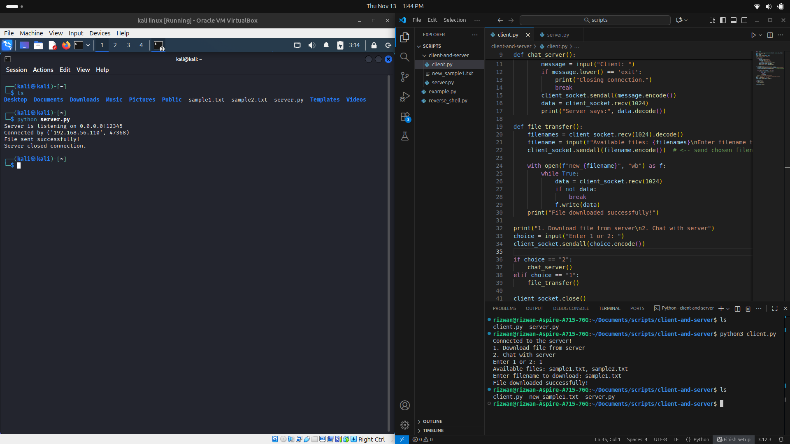

# 🛰️ TCP Chat & File Transfer (Client ↔ Server)

A simple **Python TCP Socket** project that allows two-way **chat communication** and **file transfer** between a **client** and **server** over a local network.

This project demonstrates how TCP sockets work in Python — connection establishment, data encoding, message exchange, and binary file transfer.

---

## 🧪 Features

- 📡 Real-time chat between client and server
- 📁 File transfer (server → client)
- ⚙️ Simple beginner-friendly Python code
- 💻 Works on localhost or LAN (same Wi-Fi network)

---

## 📂 Project Files

| File                  | Description                                                                               |
| --------------------- | ----------------------------------------------------------------------------------------- |
| `server.py`           | Runs the TCP server that listens for connections and sends files or chats with the client |
| `client.py`           | Connects to the server and lets you chat or download files                                |
| `README.md`           | This instruction file                                                                     |
| *(your sample files)* | Example files like `sample1.txt`, `sample2.txt` for testing downloads                     |

---

## 🚀 How to Run

### 🧩 Step 1: Clone or Download the Repository

```bash
git clone https://github.com/MuhammedRizwanpr/TCP-Filetransfer-and-chatting-to-server.git
cd TCP-Filetransfer-and-chatting-to-server
```

Or download ZIP and extract.

---

### 🧩 Step 2: Start the Server

Run on the machine that will **act as the server**:

```bash
python3 server.py
```

You’ll see:

```
Server is listening on 0.0.0.0:12345
Connected by ('192.168.xx.xx', 56789)
```

---

### 🧩 Step 3: Start the Client

On another machine (or same system, different terminal):

```bash
python3 client.py
```

When prompted:

```
1. Download file from server
2. Chat with server
Enter 1 or 2:
```

Choose:

- **1** → to download a file
- **2** → to chat with the server

---

### 🧩 Step 4: File Transfer Example

If you select option **1**, the client will receive the list of available files:

```
Available files: sample1.txt, sample2.txt
Enter filename to download: sample1.txt
```

The file will be saved on the client side as:

```
new_sample1.txt
```

✅ Transfer complete!

---

### 🧩 Step 5: Chat Example

If you select option **2**:

- Client types messages → Server sees them
- Server replies → Client receives reply

Type `exit` to close the chat.

---

## ⚙️ Configuration

If both client and server are on **the same computer**:

```python
HOST = '127.0.0.1'
```

If on **different computers (same Wi-Fi or LAN)**:

- On the **server**, use:
  ```python
  HOST = '0.0.0.0'
  ```
- On the **client**, use the server’s IP:
  ```python
  HOST = '192.168.xx.xx'
  ```

To find your server IP (Windows/Linux/macOS):

```bash
ipconfig    # on Windows
ifconfig    # on Linux/macOS
```

---

## 🧠 How It Works

1. Server starts and waits for a client connection.
2. Client connects using the server’s IP and port.
3. Client chooses between:
   - **Chat** → real-time message exchange.
   - **File Transfer** → request and download file.
4. Server sends data in small chunks (`1024` bytes).
5. Client writes received bytes to a new file.

---

## 🖼️ Screenshot

📸 *Example: File transferred successfully from Server → Client*

> Example:




---

## 🧩 Troubleshooting

| Problem                                      | Cause                 | Solution                                                           |
| -------------------------------------------- | --------------------- | ------------------------------------------------------------------ |
| `ConnectionRefusedError`                     | Wrong IP or port      | Check server IP and port; make sure server is running first        |
| `OSError: [Errno 98] Address already in use` | Port already used     | Change port number (e.g., 12346) or close previous server instance |
| Client stuck on `recv()`                     | Both waiting for data | Make sure send/recv order matches (server sends, client receives)  |
| `FileNotFoundError` on server                | File doesn’t exist    | Ensure the file exists in the server folder                        |
| Transfer stops midway                        | Network interruption  | Retry connection; try smaller chunk size (512 bytes)               |

---

## 🔋 Requirements

- Python 3.x
- Works on Windows, Linux, and macOS
- Both devices must be on the **same network** for LAN communication

---

## 📜 License

This project is open-source and free to use for learning purposes.\
You can modify, share, or use this code in your own projects.

---

## ✨ Author

**👮‍♂️ Muhammed Rizwan PR**\
Cybersecurity Enthusiast & Python Learner

> “Learning by breaking, fixing, and understanding.”

---

## 💬 Example Commands Summary

| Action       | Command                           |
| ------------ | --------------------------------- |
| Run Server   | `python3 server.py`               |
| Run Client   | `python3 client.py`               |
| Stop Program | `Ctrl + C` or type `exit` in chat |

